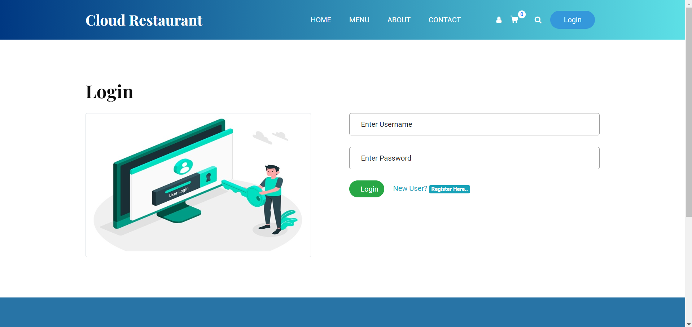
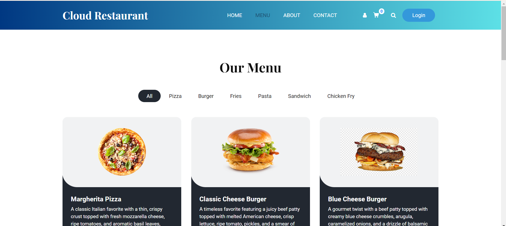
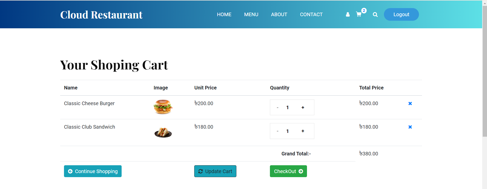
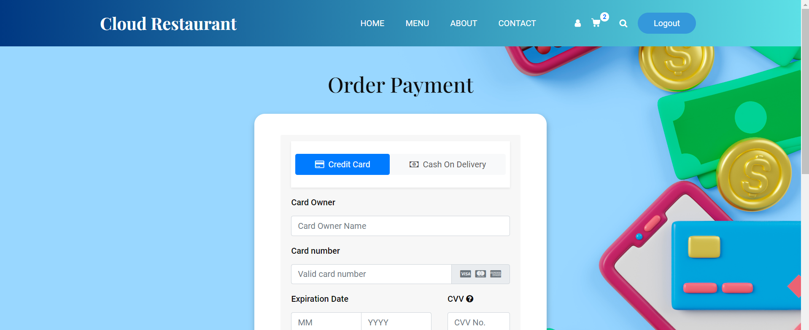
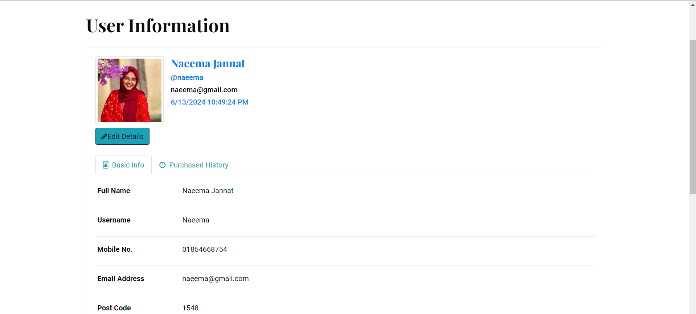
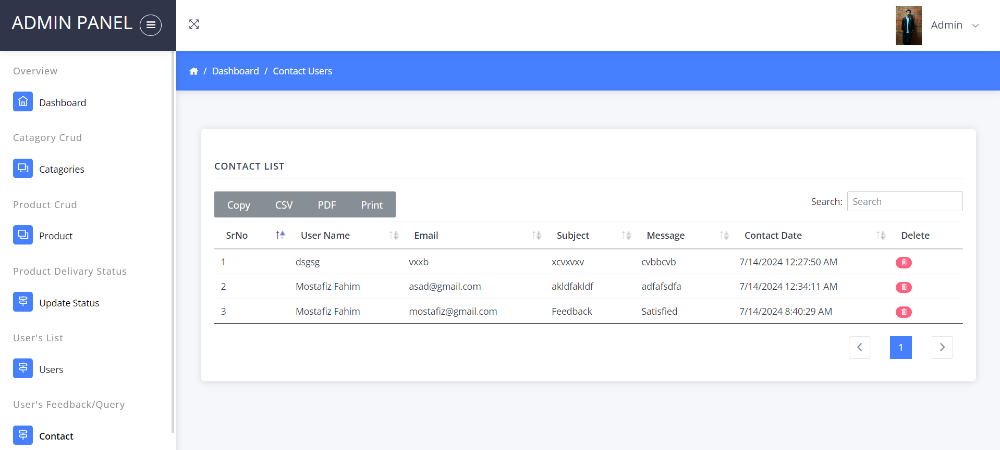
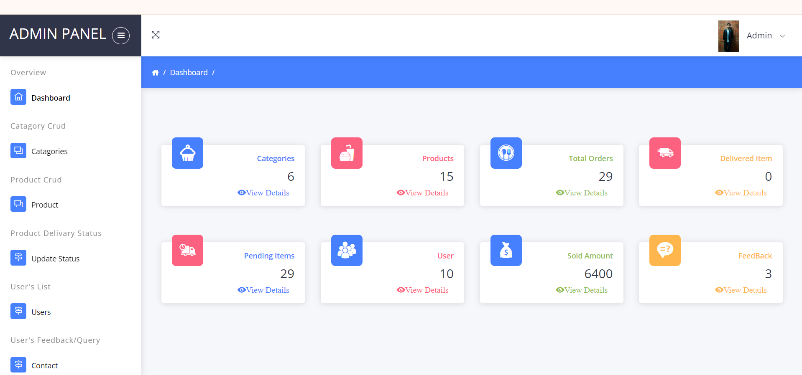
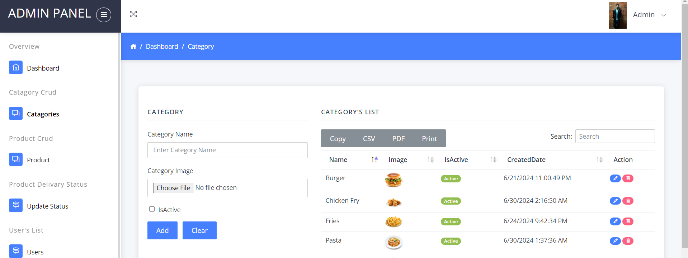

# 🍽️ Cloud Restaurant

Cloud Restaurant is an **online food ordering and management system** designed to simplify restaurant operations.  
It allows customers to browse the menu, place orders, and pay online, while admins can manage menus, orders, and customers in real time.

---

## 🚀 Features

### 👤 User Features
- Register, login, and manage profiles.
- Browse and search menu items with images and prices.
- Add items to the cart and customize orders.
- Secure online payments.
- Track order status in real time.
- Rate and provide feedback on food and delivery.

### 🧑‍💼 Admin Features
- Manage food categories and items (add, edit, delete).
- Monitor and process customer orders.
- Manage customer data and feedback.
- Generate sales reports and track performance.

---

## 🛠️ Technologies Used

| Component | Technology |
|------------|-------------|
| Frontend | HTML, CSS, C# ASP.NET |
| Backend | ASP.NET (C#) |
| Database | MS SQL Server |
| Platform | Web Application |

---

🗄️ Database Overview
| Table Name       | Description                                                                  |
| ---------------- | ---------------------------------------------------------------------------- |
| **Users**        | Stores user information such as name, email, password, address, and contact. |
| **Categories**   | Holds menu categories (e.g., Drinks, Main Course, Desserts).                 |
| **Products**     | Contains food item details, prices, images, and category links.              |
| **Carts**        | Tracks items that users add to their cart before checkout.                   |
| **Orders**       | Stores information about orders placed by users.                             |
| **OrderDetails** | Stores specific details (items, quantity) for each order.                    |
| **Payments**     | Handles payment information for orders.                                      |
| **Contacts**     | Manages customer feedback and inquiries.                                     |

🧩 The SQL scripts for creating these tables and inserting sample data are available in the sqlTableCode folder.

⚙️ How to Run the Project
🧩 Prerequisites

Before running this project, make sure you have:

Visual Studio
 or Visual Studio Code

.NET Framework / .NET SDK

Microsoft SQL Server

SQL Server Management Studio (SSMS)

A modern web browser (Chrome / Edge)

🪜 Setup Instructions
1️⃣ Clone the Repository
git clone https://github.com/MostafizFahim/Cloud-Restaurant.git
cd Cloud-Restaurant

2️⃣ Open the Project

Open the .sln file in Visual Studio
OR

Open the folder in Visual Studio Code (ensure you have the C# and .NET extensions installed).

3️⃣ Setup the Database

Open SQL Server Management Studio (SSMS).

Create a new database named CloudRestaurantDB.

Open the sqlTableCode folder.

Execute all .sql files in order to create the necessary tables and insert sample data.

4️⃣ Configure Database Connection

Locate the configuration file:

Web.config (for ASP.NET Framework)

or appsettings.json (for ASP.NET Core)

Update your connection string as shown below:

<connectionStrings>
  <add name="CloudRestaurantDB"
       connectionString="Data Source=YOUR_SERVER_NAME;Initial Catalog=CloudRestaurantDB;Integrated Security=True;"
       providerName="System.Data.SqlClient" />
</connectionStrings>

💡 Replace YOUR_SERVER_NAME with your SQL Server name (e.g., DESKTOP-1234SQLEXPRESS).

5️⃣ Run the Project

Press F5 or click Run in Visual Studio.

The project will launch in your browser (e.g., http://localhost:5000 or http://localhost:8080).

You’ll see the Cloud Restaurant homepage or login screen.

## 📊 System Overview

The **Cloud Restaurant** system connects customers, administrators, and delivery personnel on a single platform.  
Customers place and track orders, admins manage menus and orders, and delivery staff update delivery status — all in real time.

---

## 🧩 System Diagrams

### 🧠 Use Case Diagram
Depicts interactions between users (Customer, Admin) and system functionalities.

### 🔄 Data Flow Diagram
Shows the movement of data between key modules:
- User Management  
- Menu Management  
- Order & Payment Processing  

### 🧮 Entity Relationship Diagram
Represents database structure including tables:
- `Users`, `Products`, `Categories`, `Orders`, `Payments`, and `OrderDetails`.

---

## 🖼️ Screenshots

| Section | Screenshot |
|----------|-------------|
| **Login Page** |  |
| **User Interface** |  |
| **Menu Page** |  |
| **Cart Page** |  |
| **Payment Page** |  |
| **Order Details** |  |
| **Profile Management** |  |
| **Feedback Page** |  |
| **Admin Dashboard** |  |
| **Menu Management (Admin)** |  |
| **Category Management** |  |
| **Order Management** |  |
| **Customer Management** |  |
| **Selling Report** |  |

---

## 📈 Opportunities for Future Development

- Improve personalization using AI-based recommendations.  
- Integrate third-party delivery and payment systems.  
- Introduce mobile app support.  
- Add data analytics dashboards for insights and performance tracking.

---

## 👥 Contributors

| Name | ID | Role |
|------|----|------|
| **Naeema Jannat** | 20210104005 | Developer |
| **Mostafiz Fahim** | 20210104008 | Developer |
| **Asadut Jaman** | 20210104009 | Developer |

---

## 🧾 Course Information

**Course No:** CSE 3224  
**Course Name:** Information System Design & Software Engineering Lab  
**Department:** Computer Science and Engineering  
**Institution:** [Ahsanullah University of Science and Technology]  
**Instructors:**  
- Dr. Taslim Taher (Assistant Professor)  
- Ms. Tasnuva Binte Rahman (Lecturer)

---

## 📅 Submission Date

**17 July 2024**

---

## 📚 References

All technical and conceptual references are listed in the project report:  
📄 *Final Report Details.pdf*

---

> 💡 *Cloud Restaurant — bringing convenience, efficiency, and technology to modern dining.*

