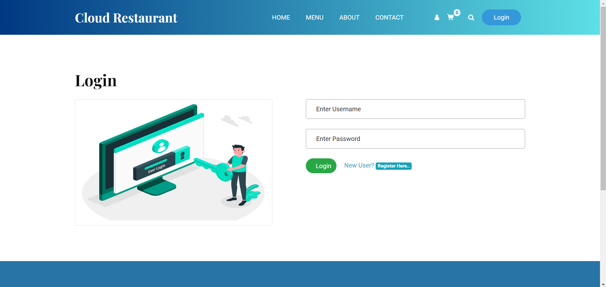
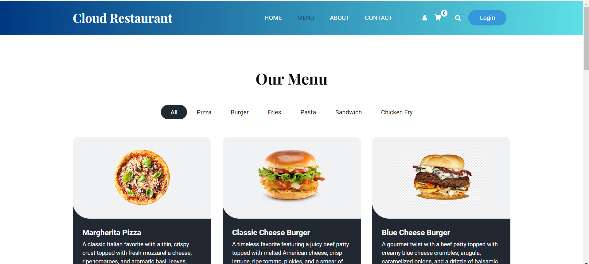
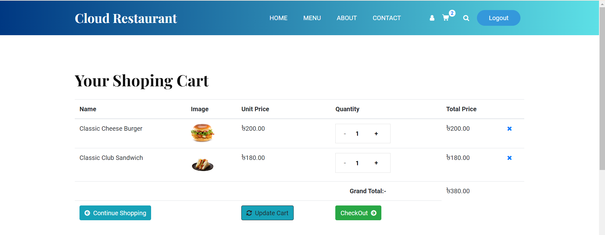
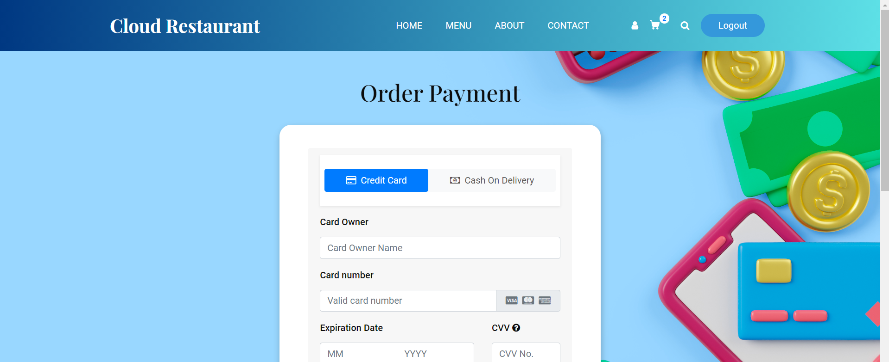
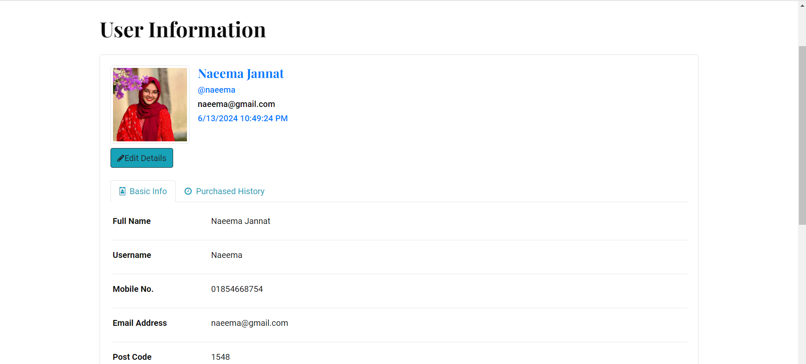
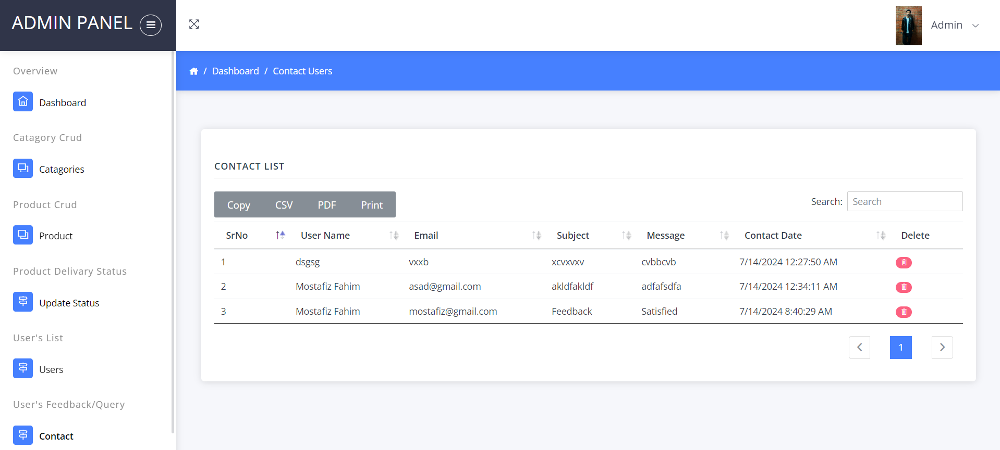
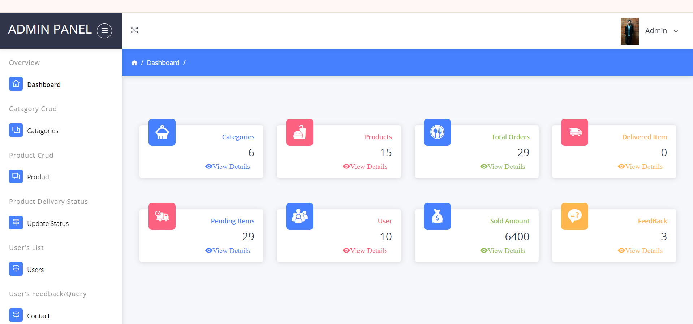
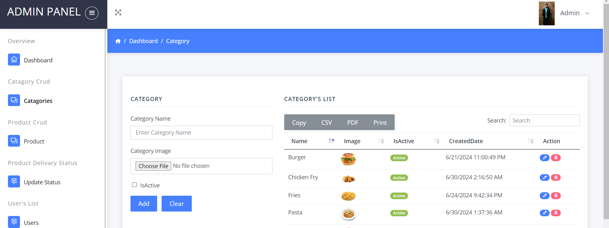

# Cloud Restaurant

Cloud Restaurant is an online food ordering and management system built with ASP.NET Web Forms. Customers can browse menu items, place orders, and make payments, while admins can manage categories, products, users, orders, contacts, and reports.

---

## Features

### User Features

- Register, login, and manage profiles.
- Browse menu items with images and prices.
- Add products to cart.
- Place orders and make payments.
- View invoice and order history.
- Send contact or feedback messages.

### Admin Features

- Manage food categories.
- Manage food products.
- Monitor and update order status.
- Manage users and contacts.
- View dashboard counts and selling reports.

---

## Technologies Used

| Component | Technology |
| --- | --- |
| Frontend | HTML, CSS, Bootstrap, ASP.NET Web Forms |
| Backend | C# ASP.NET Web Forms |
| Database | Microsoft SQL Server |
| Reporting/PDF | iTextSharp |
| Platform | .NET Framework 4.8 |

---

## Database Overview

| Table Name | Description |
| --- | --- |
| `Users` | Stores user information such as name, email, password, address, and contact. |
| `Contact` | Stores customer contact and feedback messages. |
| `Categories` | Stores menu categories. |
| `Products` | Stores food item details, prices, images, and category links. |
| `Carts` | Tracks items users add before checkout. |
| `Orders` | Stores order details for purchased products. |
| `Payment` | Stores payment information for orders. |

The original SQL scripts are in the `sqlTableCode` folder. For easier future setup, use the combined restore script:

```text
sqlTableCode/CloudDB_All_In_One_Restore.sql
```

---

## Important Database Note

This project uses **Microsoft SQL Server**, not MySQL.

If you only have **MySQL Command Line Client**, that is not enough to run this project locally. MySQL and SQL Server are different DBMS products. This application uses:

- `System.Data.SqlClient`
- SQL Server connection strings
- T-SQL stored procedures
- SQL Server table-valued parameters

To use MySQL, the project would need code changes, package changes, connection string changes, and SQL script conversion. The easiest path is to use SQL Server LocalDB, SQL Server Express, or a remote SQL Server.

---

## How to Run the Project

### Prerequisites

- Visual Studio with ASP.NET/.NET Framework support
- .NET Framework 4.8
- A SQL Server database engine, either LocalDB, SQL Server Express, full SQL Server, or remote SQL Server
- A modern browser

SSMS is helpful but not strictly required if you can run SQL scripts with `sqlcmd`.

---

## Option 1: Run Locally With SQL Server LocalDB

This is usually the lightest local option if it is already installed with Visual Studio.

1. Check whether LocalDB exists:

```powershell
sqllocaldb info
```

2. If `MSSQLLocalDB` appears, start it:

```powershell
sqllocaldb start MSSQLLocalDB
```

3. Create the database:

```powershell
sqlcmd -S "(localdb)\MSSQLLocalDB" -i "sqlTableCode\CloudDB_All_In_One_Restore.sql"
```

4. Update `Cloud Restaurant/Web.config`:

```xml
<connectionStrings>
  <add name="CloudDBConnectionString"
       connectionString="Data Source=(localdb)\MSSQLLocalDB;Initial Catalog=CloudDB;Integrated Security=True;MultipleActiveResultSets=True;"
       providerName="System.Data.SqlClient" />
</connectionStrings>
```

---

## Option 2: Run Locally With SQL Server Express

Use this if LocalDB is not available and you want a local database.

1. Install SQL Server Express.
2. Install SSMS or use `sqlcmd`.
3. Run:

```powershell
sqlcmd -S ".\SQLEXPRESS" -i "sqlTableCode\CloudDB_All_In_One_Restore.sql"
```

4. Update `Cloud Restaurant/Web.config`:

```xml
<connectionStrings>
  <add name="CloudDBConnectionString"
       connectionString="Data Source=.\SQLEXPRESS;Initial Catalog=CloudDB;Integrated Security=True;MultipleActiveResultSets=True;"
       providerName="System.Data.SqlClient" />
</connectionStrings>
```

If your SQL Server instance has another name, replace `.\SQLEXPRESS` with that instance name.

---

## Option 3: Run Without Installing SQL Server Locally

Use SQL Server on another PC, a lab machine, or a hosted SQL Server.

1. Run `sqlTableCode/CloudDB_All_In_One_Restore.sql` on the remote SQL Server.
2. Make sure TCP/IP and firewall access are enabled on that SQL Server.
3. Update `Cloud Restaurant/Web.config`:

```xml
<connectionStrings>
  <add name="CloudDBConnectionString"
       connectionString="Data Source=SERVER_IP,1433;Initial Catalog=CloudDB;User ID=YOUR_USER;Password=YOUR_PASSWORD;TrustServerCertificate=True;MultipleActiveResultSets=True;"
       providerName="System.Data.SqlClient" />
</connectionStrings>
```

If the remote SQL Server uses a named instance, the `Data Source` may look like:

```text
SERVER_IP\SQLEXPRESS
```

---

## Run the Web App

1. Open `Cloud Restaurant.sln` in Visual Studio.
2. Restore NuGet packages if Visual Studio asks.
3. Make sure `Cloud Restaurant/Web.config` points to the correct SQL Server.
4. Run with IIS Express.

Admin login is configured in `Cloud Restaurant/Web.config`:

```text
username: Mostafiz
password: 12345
```

---

## Screenshots

| Section | Screenshot |
| --- | --- |
| Login Page |  |
| User Interface |  |
| Menu Page |  |
| Cart Page |  |
| Payment Page |  |
| Order Details |  |
| Profile Management |  |
| Feedback Page |  |
| Admin Dashboard |  |
| Menu Management |  |
| Category Management |  |
| Order Management |  |
| Customer Management |  |
| Selling Report |  |

---

## Contributors

| Name | ID | Role |
| --- | --- | --- |
| Naeema Jannat | 20210104005 | Developer |
| Mostafiz Fahim | 20210104008 | Developer |
| Asadut Jaman | 20210104009 | Developer |

---

## Course Information

**Course No:** CSE 3224  
**Course Name:** Information System Design & Software Engineering Lab  
**Department:** Computer Science and Engineering  
**Institution:** Ahsanullah University of Science and Technology  
**Submission Date:** 17 July 2024

---

## References

All technical and conceptual references are listed in the project report:

```text
Reports/Final Report Details.pdf
```
